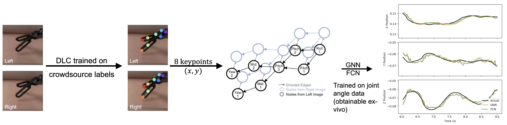
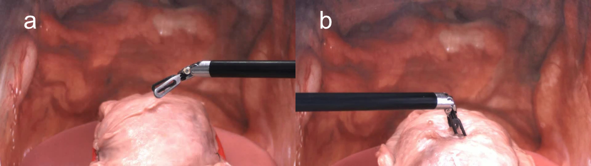

# Telesurgical Tool Vision-based Position Estimation



This project is part of the research work titled **"Vision-Based Force Estimation for Minimally Invasive Telesurgery Through Contact Detection and Local Stiffness Models"**. The project utilizes an open-source silicone dataset of simulated palpation using surgical robot end effectors. 

The project is based on DeepLabCut to track multiple keypoints of the surgical robot’s end effector. A fully connected network and a GraphSAGE graph neural network are used to reconstruct the normalized 3D position of the end effector. 

## Getting Started

### Installation

To install the required dependencies, run:

```bash
pip install -r requirements.txt
```

### Run the Demo

1. **Download the Silicone Dataset**: [enhanced-telerobotics/single_psm_manipulation_dataset](https://github.com/enhanced-telerobotics/single_psm_manipulation_dataset)

   Following the instruction of the original repository to extract images and joint state labels from the bag. Make sure to unpack and rename the datasets using each bag name. Your file structure should look like the following:

   ```
   Path_to_root
   ├── R1_M1_T1_1
   │   ├── labels_30hz.txt
   │   ├── (Optional) *.jpg
   │   ├── (Optional) *.mp4
   │   └── ...
   ```

2. **Download Pre-generate DeepLabCut Keypoints Tracking Sheets** for the silicone dataset: [Download Link](https://drive.google.com/file/d/1kkjRnffpC0ZWf0m7RvENEb1KkhbDvi4v/view?usp=sharing)

3. **Run the Demo Notebook**: Open and run [`fcnn-train.ipynb`](fcnn-train.ipynb) and [`gnn-train.ipynb`](gnn-train.ipynb) for the model training and prediction pipeline. Ensure you modify paths setting in notebooks to reflect your local paths correctly.

## Transfer Learning to the Novel Dataset
Similar to the silicone dataset, we proposed a realistic dataset which contains 40 demonstrations of either a left-side or right-side PSM being used on raw chicken skin wrapped around chicken thigh. 



### Download Links
1. **Download the Realistic Dataset**: [Download Link](https://zenodo.org/records/21041361)

2. **Download Pre-generate DeepLabCut Keypoints Tracking Sheets** for the realistic dataset: [Download Link](https://drive.google.com/file/d/1sQq_ApYU7gmWQAb0tuR1JeMyx3BFAbxZ/view?usp=drive_link)

### Dataset Format

The data is in the ROS ".bag" format. With the nomenclature: Material_Arm_Viewpoint_Index.bag

| Material      | Description          |
| --------------|----------------------|
| M#            | Chicken Skin Index   |

| Arm           | Description          |
| --------------|----------------------|
| L             | PSM1                |
| R             | PSM2                |

| Viewpoint     | Description          |
| --------------|----------------------|
| V1            | Camera Base Down Shift |
| V2            | Camera Base Up Shift   |

### ROS Topics

| Topic   | Type |
|---------|------|
|/camera/left/image_color/compressed     |sensor_msgs/CompressedImage
|/camera/right/image_color/compressed    |sensor_msgs/CompressedImage
|/dvrk/PSMx/jacobian_body                |std_msgs/Float64MultiArray
|/dvrk/PSMx/jacobian_spatial             |std_msgs/Float64MultiArray
|/dvrk/PSMx/position_cartesian_current   |geometry_msgs/PoseStamped
|/dvrk/PSMx/position_cartesian_desired   |geometry_msgs/PoseStamped
|/dvrk/PSMx/state_jaw_current            |sensor_msgs/JointState
|/dvrk/PSMx/state_jaw_desired            |sensor_msgs/JointState
|/dvrk/PSMx/state_joint_current          |sensor_msgs/JointState
|/dvrk/PSMx/state_joint_desired          |sensor_msgs/JointState
|/dvrk/PSMx/twist_body_current           |geometry_msgs/TwistStamped
|/dvrk/PSMx/wrench_body_current          |geometry_msgs/WrenchStamped
|/force_sensor                           |geometry_msgs/WrenchStamped

*Note*: Since the L and R demonstrations are operated with different arms, the topic names in the bags are different. Make the necessary adjustments to extract the corresponding bags or use this [repository](https://github.com/Stillrainy/single_psm_manipulation_dataset) to extract data for both arms.

### Train Test Split

The dataset is divided into four categories for training and testing:

1. **Seen View Seen Material (Train)**: Training data with the same material and camera viewpoint.
2. **Unseen View Seen Material (Test)**: Testing data with the same material but a different camera viewpoint.
3. **Seen View Unseen Material (Test)**: Testing data with a different material but the same camera viewpoint.
4. **Unseen Material and View (Test)**: Testing data with both a different material and a different camera viewpoint.

| **Seen View Seen Material** | **Unseen View Seen Material** | **Seen View Unseen Material** | **Unseen Material and View** |
|-------------------------------------|--------------------------------------|--------------------------------------|-------------------------------------|
| M1_L_V1_1                           | M1_L_V2_1                            | M2_L_V1_1                            | M2_L_V2_1                           |
| M1_L_V1_2                           | M1_L_V2_2                            | M2_L_V1_2                            | M2_L_V2_2                           |
| M1_R_V1_1                           | M1_R_V2_1                            | M2_R_V1_1                            | M2_R_V2_1                           |
| M1_R_V1_2                           | M1_R_V2_2                            | M2_R_V1_2                            | M2_R_V2_2                           |
| M3_L_V1_1                           | M3_L_V2_1                            | M4_L_V1_1                            | M4_L_V2_1                           |
| M3_L_V1_2                           | M3_L_V2_2                            | M4_L_V1_2                            | M4_L_V2_2                           |
| M3_R_V1_1                           | M3_R_V2_1                            | M4_R_V1_1                            | M4_R_V2_1                           |
| M3_R_V1_2                           | M3_R_V2_2                            | M4_R_V1_2                            | M4_R_V2_2                           |
| M5_L_V1_1                           | M5_L_V2_1                            | -                                    | -                                   |
| M5_L_V1_2                           | M5_L_V2_2                            | -                                    | -                                   |
| M5_R_V1_1                           | M5_R_V2_1                            | -                                    | -                                   |
| M5_R_V1_2                           | M5_R_V2_2                            | -                                    | -                                   |

## Citation

If you find this project or the associated paper helpful in your research, please cite it as follows:

```
@article{Yang_2024, 
  title={Vision-Based Force Estimation for Minimally Invasive Telesurgery Through Contact Detection and Local Stiffness Models}, 
  ISSN={2424-9068}, 
  url={http://dx.doi.org/10.1142/S2424905X24400087}, 
  DOI={10.1142/s2424905x24400087}, 
  journal={Journal of Medical Robotics Research}, 
  publisher={World Scientific Pub Co Pte Ltd}, 
  author={Yang, Shuyuan and Le, My H. and Golobish, Kyle R. and Beaver, Juan C. and Chua, Zonghe}, 
  year={2024}, 
  month={Jul}
}
```

## Contact

For any questions, please feel free to email [sxy841@case.edu](mailto:sxy841@case.edu).
